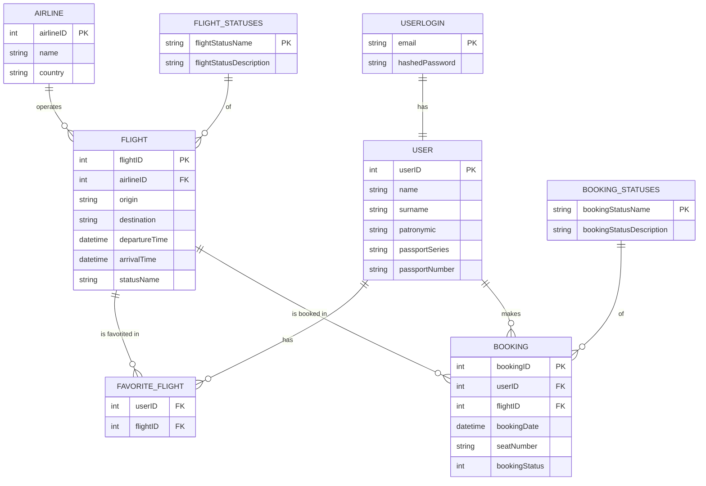

## Логическая модель БД

```mermaid
erDiagram
    USER {
        int userID PK
        string name
        string surname
        string patronymic
        string passportSeries
        string passportNumber
    }

    USERLOGIN {
        string email PK
        string hashedPassword
    }

    AIRLINE {
        int airlineID PK
        string name
        string country
    }

    FLIGHT {
        int flightID PK
        int airlineID FK
        string origin
        string destination
        datetime departureTime
        datetime arrivalTime
        string statusName
    }

    FLIGHT_STATUSES {
        string flightStatusName PK
        string flightStatusDescription
    }

    BOOKING {
        int bookingID PK
        int userID FK
        int flightID FK
        datetime bookingDate
        string seatNumber
        int bookingStatus
    }

    BOOKING_STATUSES {
        string bookingStatusName PK
        string bookingStatusDescription
    }

    FAVORITE_FLIGHT {
        int userID FK
        int flightID FK
    }

    USER ||--o{ BOOKING : "makes"
    BOOKING_STATUSES ||--o{ BOOKING : "of"
    FLIGHT_STATUSES ||--o{ FLIGHT : "of"
    USER ||--o{ FAVORITE_FLIGHT : "has"
    USERLOGIN ||--|| USER : "has"
    AIRLINE ||--o{ FLIGHT : "operates"
    FLIGHT ||--o{ BOOKING : "is booked in"
    FLIGHT ||--o{ FAVORITE_FLIGHT : "is favorited in"
```
